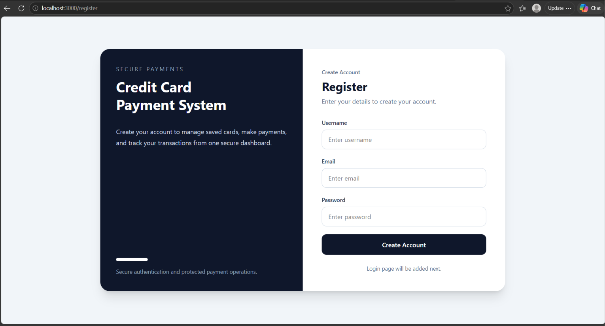
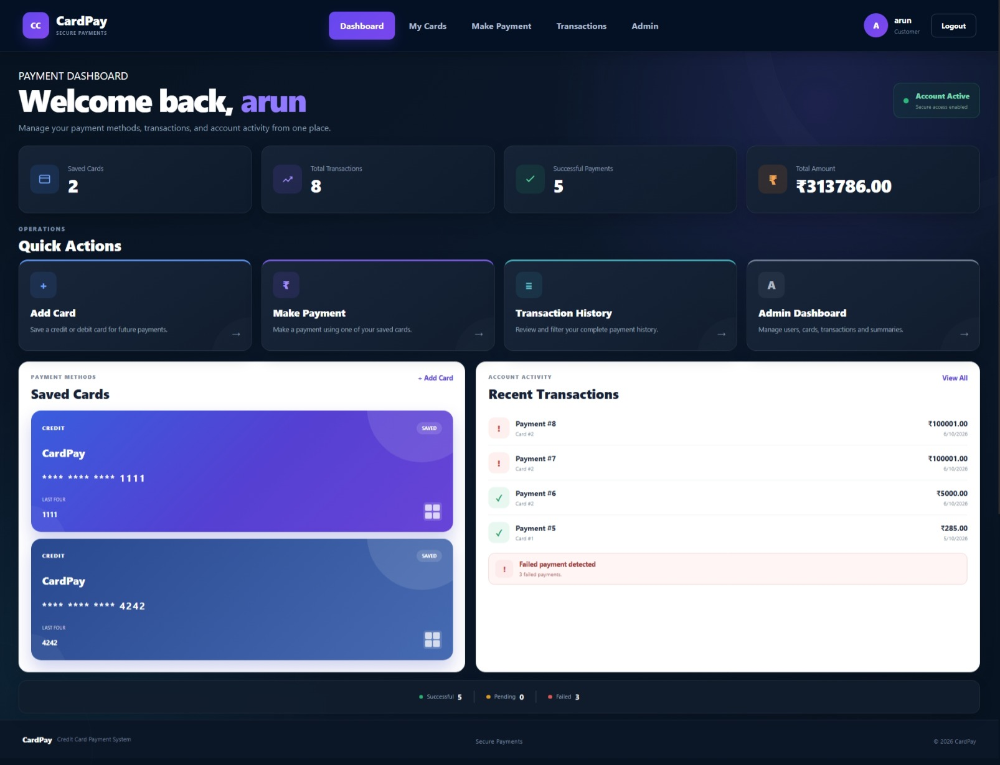
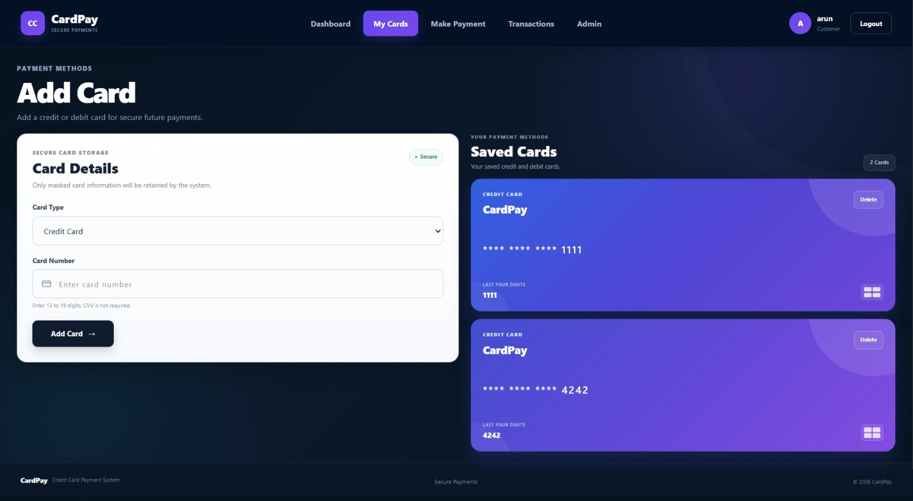
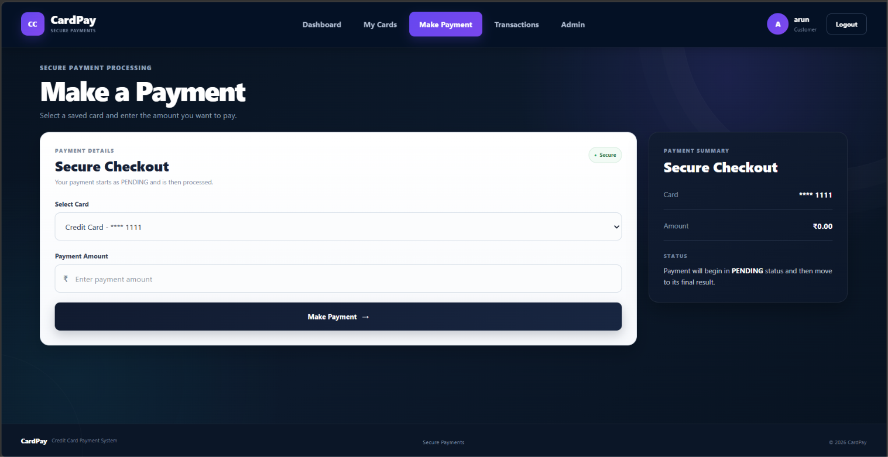
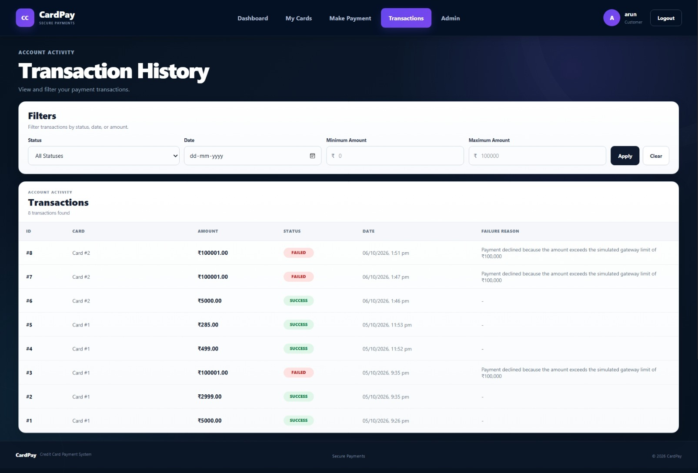
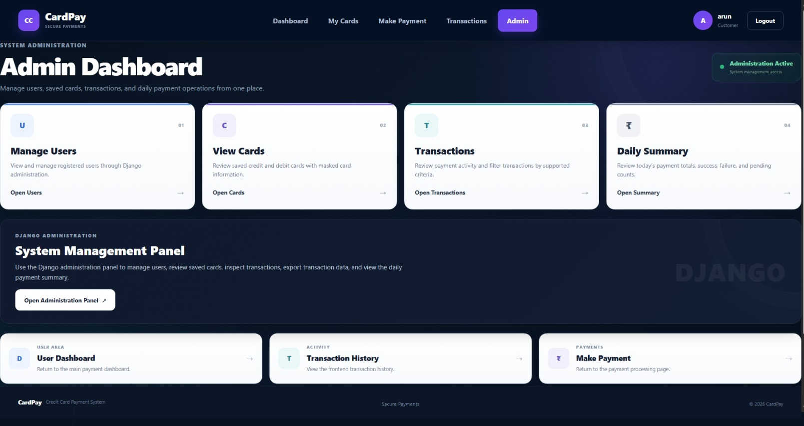
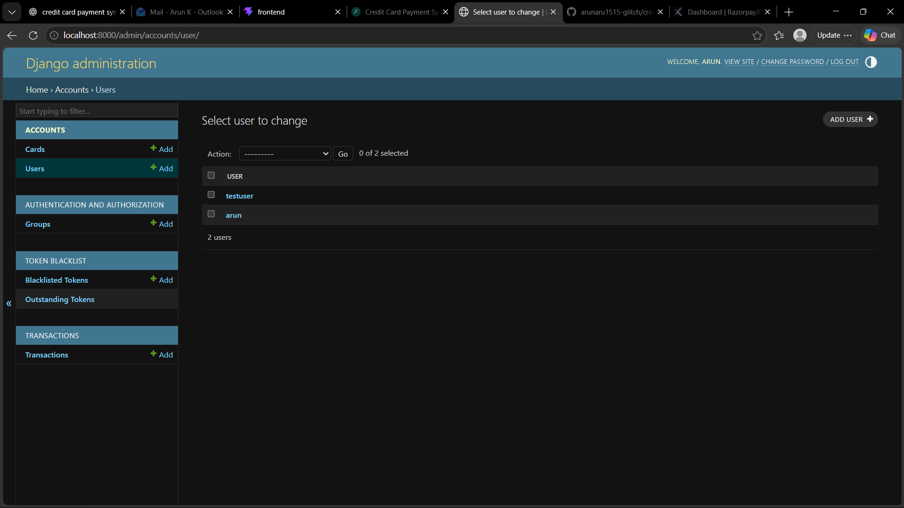
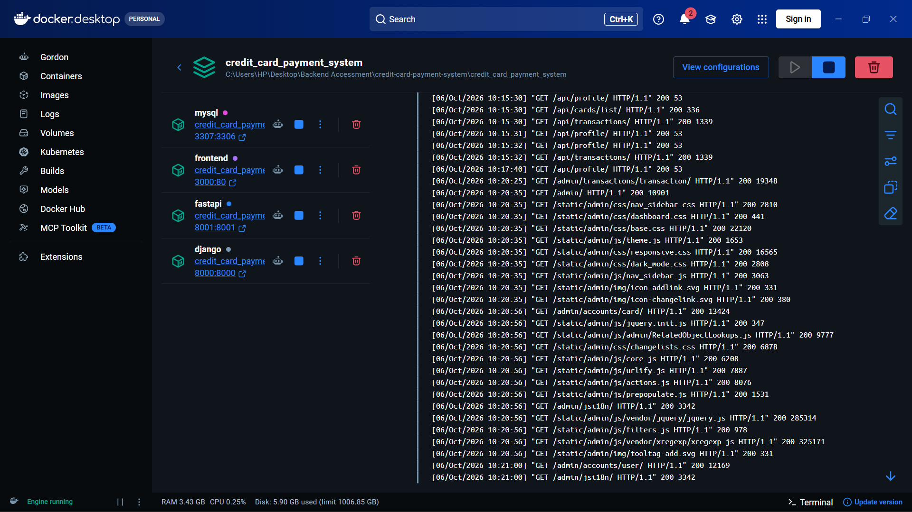
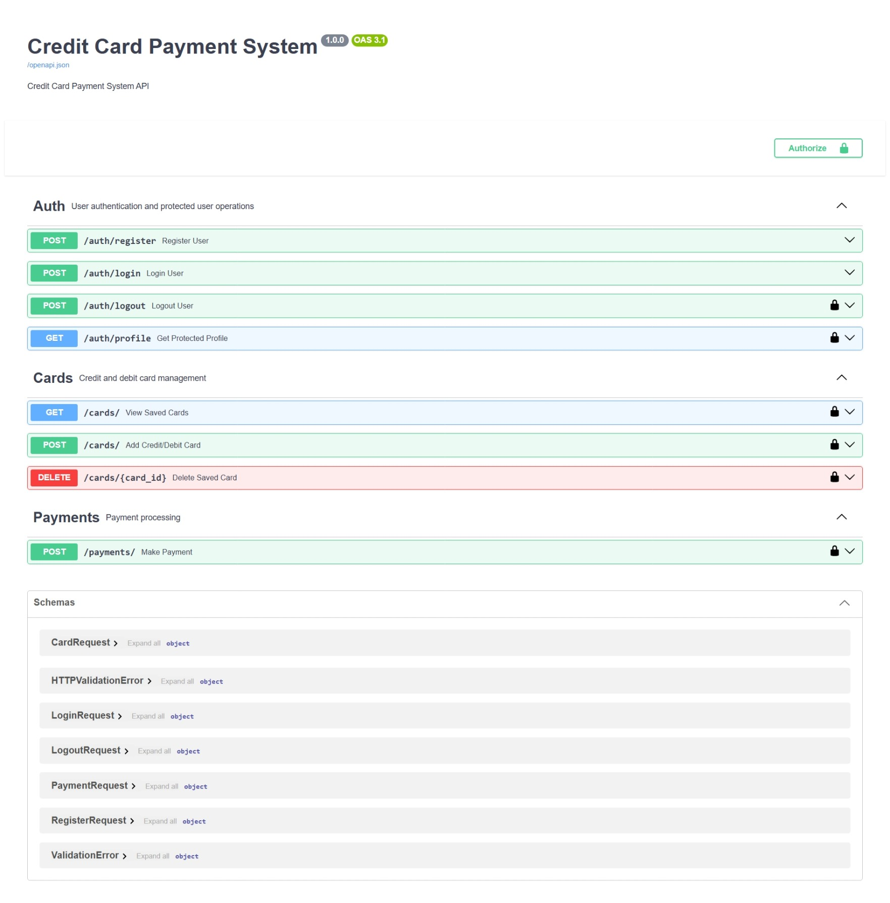
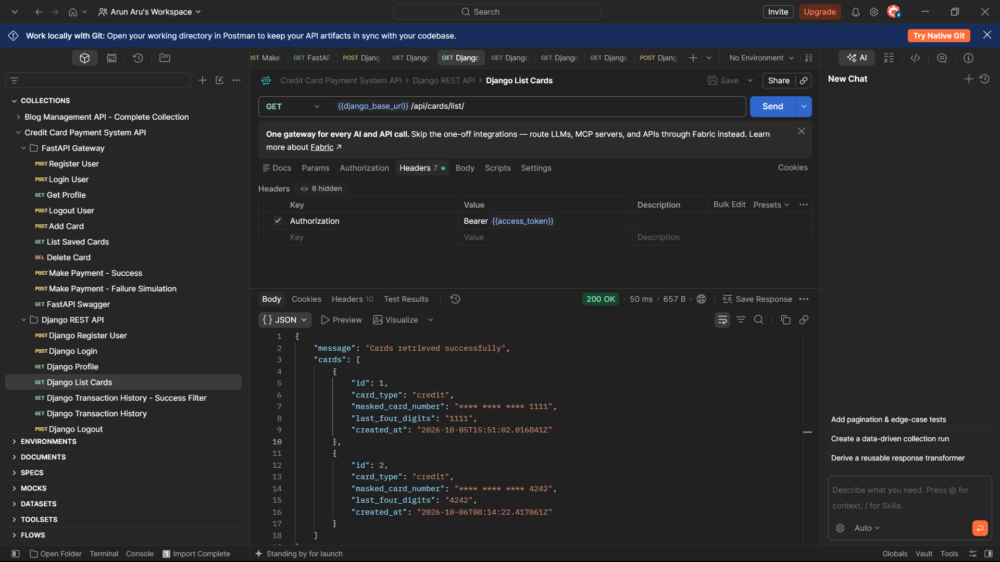

# Credit Card Payment System

A full-stack Credit Card Payment System built using React, Django REST Framework, FastAPI, MySQL, and Docker.

The application supports secure user authentication, credit/debit card management, payment processing, transaction management, administrative operations, API documentation, automated testing, and Docker-based deployment.

---

## 1. Features

### User Authentication

- User registration
- JWT-based login
- JWT token authentication
- Logout with refresh-token blacklisting
- Protected user profile
- Encrypted password storage

### Card Management

- Add credit card
- Add debit card
- View saved cards
- Delete saved cards
- Card number masking
- Only masked card number and last four digits are stored
- CVV is not stored

### Payment Processing

- Payment processing through FastAPI
- Initial `PENDING` transaction status
- Simulated payment gateway processing
- `SUCCESS` payment status
- `FAILED` payment status
- Failure reason for declined payments

### Transaction Management

- View transaction history
- Filter by status
- Filter by minimum amount
- Filter by maximum amount
- Filter by date
- Transaction ownership protection
- Admin transaction management
- CSV export support

### Admin Panel

- Manage users
- Manage cards
- View transactions
- Daily payment summary
- Django administration interface

### Frontend

- Register
- Login
- Dashboard
- Add Card
- Make Payment
- Transaction History
- Admin Dashboard
- Responsive fintech-style UI

### API Documentation

- FastAPI Swagger UI
- OpenAPI documentation
- Protected API endpoints
- Postman testing support

### Testing

- Authentication tests
- Card management tests
- Transaction tests
- Payment API tests
- Payment service tests
- Django test coverage
- FastAPI test coverage

### Docker

- Dockerized Django backend
- Dockerized FastAPI backend
- Dockerized React frontend
- Dockerized MySQL database
- Docker Compose orchestration

---

## 2. Technology Stack

| Layer | Technology |
|---|---|
| Frontend | React, Tailwind CSS, Vite |
| Backend | Django, Django REST Framework |
| Payment Service | FastAPI |
| Database | MySQL |
| Authentication | JWT / Simple JWT |
| API Documentation | Swagger / OpenAPI |
| Testing | Django TestCase, unittest, coverage |
| Web Server | Nginx |
| Containerization | Docker, Docker Compose |
| Version Control | Git, GitHub |

---

## 3. Project Structure

```text
credit_card_payment_system/
│
├── database/
│   └── Dockerfile
│
├── django_backend/
│   ├── accounts/
│   │   ├── migrations/
│   │   ├── admin.py
│   │   ├── apps.py
│   │   ├── models.py
│   │   ├── serializers.py
│   │   ├── tests.py
│   │   ├── urls.py
│   │   └── views.py
│   │
│   ├── config/
│   │   ├── asgi.py
│   │   ├── settings.py
│   │   ├── urls.py
│   │   └── wsgi.py
│   │
│   ├── transactions/
│   │   ├── migrations/
│   │   ├── admin.py
│   │   ├── apps.py
│   │   ├── models.py
│   │   ├── serializers.py
│   │   ├── tests.py
│   │   ├── urls.py
│   │   └── views.py
│   │
│   ├── Dockerfile
│   ├── manage.py
│   └── requirements.txt
│
├── fastapi_payment/
│   ├── routers/
│   │   ├── auth_router.py
│   │   ├── card_router.py
│   │   └── payment_router.py
│   │
│   ├── services/
│   │   └── payment_service.py
│   │
│   ├── tests/
│   │   ├── test_payment.py
│   │   └── test_payment_service.py
│   │
│   ├── Dockerfile
│   ├── main.py
│   ├── requirements.txt
│   └── schemas.py
│
├── frontend/
│   ├── public/
│   ├── src/
│   │   ├── components/
│   │   ├── pages/
│   │   ├── App.jsx
│   │   └── main.jsx
│   ├── Dockerfile
│   ├── nginx.conf
│   ├── package.json
│   └── vite.config.js
│
├── docs/
│   └── screenshots/
│       ├── Login.png
│       ├── Register.png
│       ├── Dashboard.png
│       ├── Add_card.png
│       ├── Make_Payment.png
│       ├── Transactions.png
│       ├── Admin_dashboard.png
│       ├── Django_admin_panel.png
│       ├── Docker_Desktop.png
│       ├── Fastapi_swagger.png
│       └── Postman_Testing.png
│
├── Postman_collection.json
├── docker-compose.yml
├── .gitignore
└── README.md
```

---

## 4. System Architecture

```text
                    ┌──────────────────────┐
                    │     React Frontend   │
                    │     + Tailwind CSS   │
                    └──────────┬───────────┘
                               │
              ┌────────────────┴────────────────┐
              │                                 │
              ▼                                 ▼
   ┌────────────────────┐             ┌────────────────────┐
   │ Django REST API    │             │ FastAPI Payment    │
   │ Authentication     │             │ Processing Service │
   │ Cards              │             │ Payment Simulation │
   │ Transactions       │             │ SUCCESS / FAILED   │
   │ Admin Operations   │             └─────────┬──────────┘
   └──────────┬─────────┘                       │
              │                                 │
              └────────────────┬────────────────┘
                               ▼
                    ┌──────────────────────┐
                    │       MySQL          │
                    │ Users                │
                    │ Cards                │
                    │ Transactions         │
                    │ Admin Operations     │
                    └──────────────────────┘
```

---

## 5. Database Schema

### Users

Stores application user information and authentication details.

| Field | Description |
|---|---|
| ID | Unique user identifier |
| Username | User login name |
| Email | Unique email address |
| Password | Encrypted password |
| Date Joined | Account creation date |

### Cards

Stores saved credit/debit card information without storing the actual card number.

| Field | Description |
|---|---|
| ID | Unique card identifier |
| User | Card owner |
| Card Type | Credit / Debit |
| Masked Card Number | Masked representation |
| Last Four Digits | Last four digits of card |
| Created At | Card creation timestamp |

### Transactions

Stores payment and transaction information.

| Field | Description |
|---|---|
| ID | Unique transaction identifier |
| User | Transaction owner |
| Card | Associated saved card |
| Amount | Payment amount |
| Status | PENDING / SUCCESS / FAILED |
| Failure Reason | Reason for failed transaction |
| Transaction Date | Transaction timestamp |

---

## 6. Authentication Flow

```text
Register
   ↓
User Account Created
   ↓
Login
   ↓
JWT Access Token + Refresh Token
   ↓
Protected API Requests
   ↓
Logout
   ↓
Refresh Token Blacklisted
```

Protected APIs require JWT authentication.

Example:

```http
Authorization: Bearer <access_token>
```

---

## 7. Payment Flow

```text
React Frontend
      ↓
FastAPI Payment API
      ↓
Create Transaction
      ↓
PENDING
      ↓
Payment Simulation
      ↓
 ┌───────────────┐
 │               │
 ▼               ▼
SUCCESS        FAILED
                 │
                 ▼
          Failure Reason
```

Payments start with a `PENDING` status and are finally updated to either `SUCCESS` or `FAILED`.

---

## 8. API Documentation

### FastAPI Swagger

FastAPI provides interactive Swagger/OpenAPI documentation.

```text
http://localhost:8001/docs
```

### Django REST API

The Django backend provides authentication, card management, transaction management, filtering, CSV export, and administrative APIs.

Django API endpoints are also tested through the supplied Postman collection.

---

## 9. Main API Operations

### Authentication

```text
POST /api/register/
POST /api/login/
POST /api/logout/
GET  /api/profile/
```

### Card Management

```text
POST   /api/cards/
GET    /api/cards/
DELETE /api/cards/<id>/
```

### Transactions

```text
GET   /api/transactions/
POST  /api/transactions/create/
PATCH /api/transactions/<id>/status/
```

### Payment

```text
POST /payments/
```

---

## 10. Postman Collection

The complete Postman collection is available in the project root.

[Postman Collection](Postman_collection.json)

The collection contains requests for:

- Authentication
- User profile
- Card management
- Payment processing
- Successful payment
- Failed payment
- Transaction history
- Transaction filtering
- Logout

---

## 11. Running the Project with Docker

Make sure Docker Desktop is running.

From the project root:

```bash
docker compose up --build
```

To run the containers in detached mode:

```bash
docker compose up -d --build
```

To check running containers:

```bash
docker compose ps
```

To stop the project:

```bash
docker compose down
```

> Do not use `docker compose down -v` unless you intentionally want to remove Docker volumes and database data.

---

## 12. Application Services

The project consists of:

```text
Frontend
Django Backend
FastAPI Payment Service
MySQL Database
```

The service configuration and ports are defined in:

```text
docker-compose.yml
```

---

## 13. Local Development

### Django Backend

```bash
cd django_backend
python manage.py migrate
python manage.py runserver
```

### FastAPI Backend

```bash
cd fastapi_payment
uvicorn main:app --reload
```

### Frontend

```bash
cd frontend
npm install
npm run dev
```

---

## 14. Testing

### Django Tests

```bash
cd django_backend
python manage.py test
```

### FastAPI Tests

```bash
cd fastapi_payment
pytest
```

The project contains tests covering authentication, card management, transactions, payment API behaviour, and payment service functionality.

---

## 15. Security

The application follows the required security rules:

- CVV is not stored
- Actual card numbers are not stored
- Passwords are encrypted
- JWT authentication is used
- Protected routes require authentication
- Input validation is implemented
- Django ORM is used for database access
- Transaction ownership is validated
- Refresh-token blacklisting is implemented during logout

---

## 16. Admin Panel

The Django administration interface provides:

- User management
- Card management
- Transaction management
- Payment summary
- Administrative operations

Admin URL:

```text
http://localhost:8000/admin/
```

---

## 17. Screenshots

### Login


### Register



### Dashboard



### Add Card



### Make Payment



### Transactions



### Admin Dashboard



### Django Admin Panel



### Docker Desktop



### FastAPI Swagger



### Postman Testing



---

## 18. GitHub Repository

GitHub Repository:

https://github.com/arunaru1515-glitch/credit-card-payment-system

---

## 19. Project Requirements Coverage

| Module | Status |
|---|---|
| User Authentication | Completed |
| Card Management | Completed |
| Payment Processing | Completed |
| Transaction Management | Completed |
| Admin Panel | Completed |
| React Frontend | Completed |
| MySQL Database | Completed |
| Security Requirements | Completed |
| API Documentation | Completed |
| Docker Deployment | Completed |
| Testing | Completed |
| Git & Documentation | Completed |

---

## 20. Final Submission

The project includes:

- GitHub repository
- Docker configuration
- Postman collection
- UI screenshots
- Django Admin screenshot
- FastAPI Swagger screenshot
- Docker running screenshot
- Project documentation

---

## 21. Author

**Arun K**

Credit Card Payment System  
Full Stack Junior Application Project